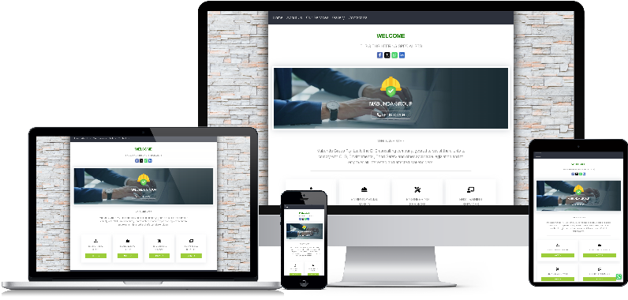

# Mabunda Group Website


 
# Table of contents
- [Introduction](#introduction)
- [Environment](#environment)
- [Tech Stack](#tech-stack)
- [How to run the application](#how-to-run-the-application)
- [Issues](#issues)
- [References](#references)
- [Licence](#licence)


# Introduction

Mobile-friendly angular 2+ website developed using lazy-loading approach to enhance site-performance. CSS Grid-layout and Flexbox models were implemented to achiece the responsive UI design of this site. 


[Back to top](#table-of-contents)

# Environment

- Operating System - Windows 11
- Angular CLI - v18.2.11
- Visual Studio Code
- Node.js - v20.11.1
- GitHub & Git Bash

[Back to top](#table-of-contents)

# Tech stack
- Responsive Web Design (HTML5, SCSS, Bootstrap5, FontAwesome, Lazy-loading).
- Angular/Typescript framework - v18.2.11
- Fetch API - v18.2.11
- Google Maps

[Back to top](#table-of-contents)

# How to run the application

### 1. Installation
Ensure that you have following items are installed in your computer:

- Visual Studio Code
- Node.js
- Angular CLI

### 2. Clone `GitHub` repository

Clone the project from Github repository into your local repository:  [ Vehicle Tracking System ](https://github.com/mystackbox/prj-Mabunda Group). For more information about how to clone the GitHub repository, see [Cloning GitHub repository](https://docs.github.com/en/repositories/creating-and-managing-repositories/cloning-a-repository).

### 3. Update Google Maps API Key
Ensure that your in possession of Google Maps API Key. Open index.html in the source directory of the project and replace `YOUR_API_KEY` with your Google Maps API Key.

```javascript
 <script async src="https://maps.googleapis.com/maps/api/js?key=YOUR_API_KEY&loading=async&callback=Function.prototype&v=weekly"></script>
``` 
### 4. Start the Localhost server

Run the following command in your `CLI` to install all the rrequired packages:
```javascript
npm install
```
Run the following command in your `CLI` to start the `localhost` server.
```javascript
ng serve
``` 
Once the `localhost` server is running, navigate to `http://localhost:4200/` or copy/paste `http://localhost:4200/` in your browser address-bar, then press enter. 

[Back to top](#table-of-contents)

# Issues
- The application uses Google Maps services which requires the APK Key.

[Back to top](#table-of-contents)

# References

- For more information related to Angular setup, please check out the [Angular documentation](https://angular.io/docs) page.
- For more information related to Angular CLI, please check out the [Angular CLI Overview and Command Reference](https://angular.io/cli) page.
- For more information related to Node.js, please check out the [Introduction to Node.js](https://nodejs.org/en/learn/getting-started/introduction-to-nodejs) page.
- For more information related to Node Package Manager (NPM), please check out the [npm Docs](https://docs.npmjs.com/) page.

[Back to top](#table-of-contents)

# Licence

MIT License

Copyright (c) 2024 | Yingisani

Permission is hereby granted, free of charge, to any person obtaining a copy of this software and associated documentation files (the "Software"), to deal in the Software without restriction, including without limitation the rights to use, copy, modify, merge, publish, distribute, sublicense, and/or sell copies of the Software, and to permit persons to whom the Software is furnished to do so, subject to the following conditions:

The above copyright notice and this permission notice shall be included in all copies or substantial portions of the Software.

THE SOFTWARE IS PROVIDED "AS IS", WITHOUT WARRANTY OF ANY KIND, EXPRESS OR IMPLIED, INCLUDING BUT NOT LIMITED TO THE WARRANTIES OF MERCHANTABILITY, FITNESS FOR A PARTICULAR PURPOSE AND NONINFRINGEMENT. IN NO EVENT SHALL THE AUTHORS OR COPYRIGHT HOLDERS BE LIABLE FOR ANY CLAIM, DAMAGES OR OTHER LIABILITY, WHETHER IN AN ACTION OF CONTRACT, TORT OR OTHERWISE, ARISING FROM, OUT OF OR IN CONNECTION WITH THE SOFTWARE OR THE USE OR OTHER DEALINGS IN THE SOFTWARE..

[Back to top](#table-of-contents)
